# Сравнение систем Селькова и Селькова-Строгатца

Система Селькова, которую мы рассматривали раньше выглядит так:

$$
\begin{aligned}
&\frac{d u}{d t}=\vartheta-u v^2 \\
&\frac{d v}{d t}=u v^2-\omega v
\end{aligned}
$$

Система Селькова-Строгаца из статьи `"Анализ стохастической возбудимости в простой кинетической модели гликолиза"` выглядит так:

$$
\begin{aligned}
&\frac{d x}{d t}=-x+a y+x^2 y \\
&\frac{d y}{d t}=b-a y-x^2 y
\end{aligned}
$$

То есть **v** эквивалентно **x**, а **u** эквивалентно **y**, переменные "меняются" местами, и первое уравнение старой системы является аналогом второго уравнения новой системы. Это видно из знака при множителе с квадратом.  Не критично, но стоит учитывать. 

Так же числовая константа ($\omega$) в старой модели стоит перед **v** (второе уравнение), а в новой системе константа ($a$) стоит перед **y** (который есть эквивалент **u**), что тоже не особо важно, но делает сложным сравнение поведения системы в каком-то конкретном регионе параметров.

# Зона генерации паттернов - теория

Картинки, полученные мной аналитически, совпадают с такими же из статьи про спиральные волны. Вот сравнение мои - цветные, зона паттернов - бежевая, $d = \frac{D_x}{D_y}$. Обращаю внимание на то, что в картинках их статьи шкала Х странно подписана, шкала линейная, но не все отсчёты подписаны.

## d = 6.4

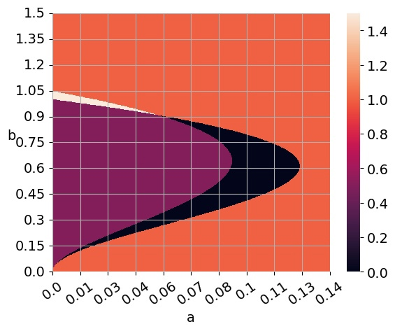

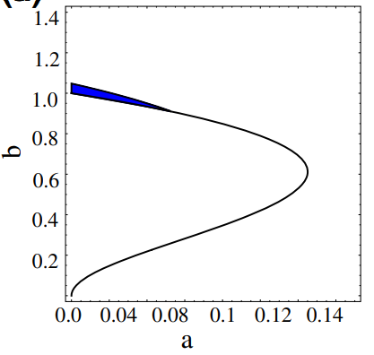

## d = 8

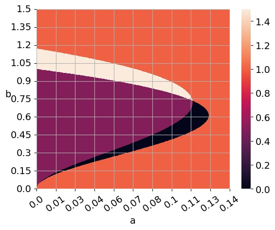
  
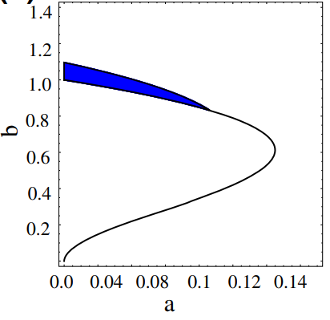

## d = 10

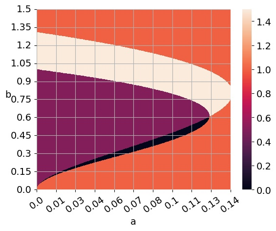

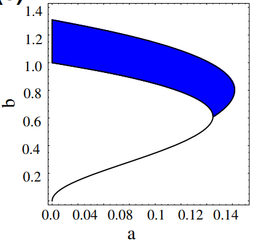

# Зона генерации паттернов - практика

Проверил зону генерации экспериментально, методология такая:
* Перебираю по сетке a и b, считаю процесс (без шума), стартуя с косинусов. 
* Когда сошлось, отмечаю амплитуду (макс - мин) итоговой структуры цветом на графике в точке (a,b)

Тут есть такой же феномен, как и раньше: когда зона не благоприятствует генерации паттернов они затухают, но на мелком масштабе форму сохраняют до последнего.

По картинке видно, что фактически генерация "залезает" в зону, неустойчивости по Хопфу. Посчитал 2 картинки, первая с шагом 0.01 по пространству, 0.001 по времени. Вторая 0.005 по пространству, 0.00025 по времени. Выглядят одинаково. Пространственная координата там и там на [0,1], 101 и 201 точка на сетке соответственно.

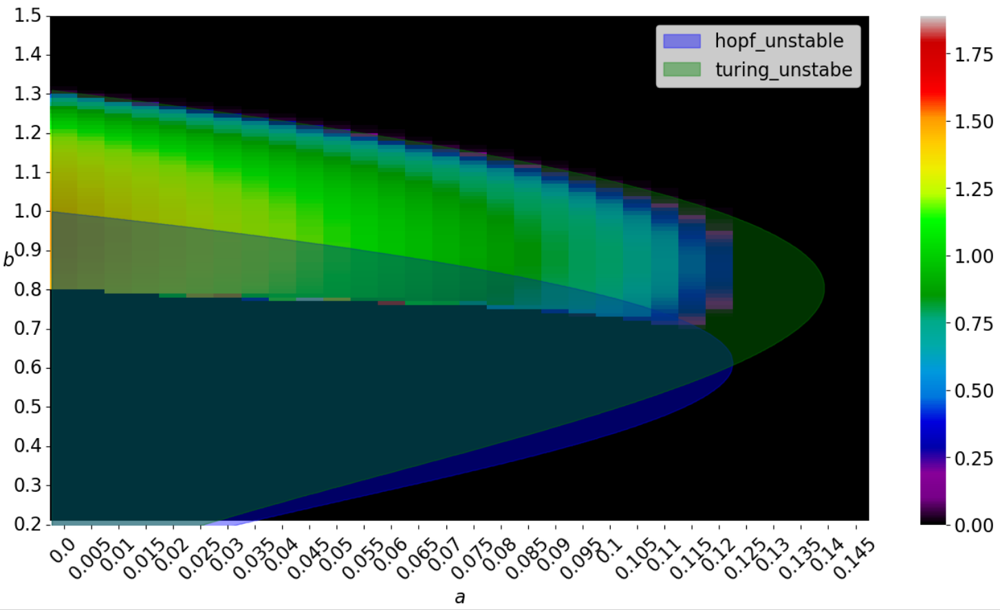

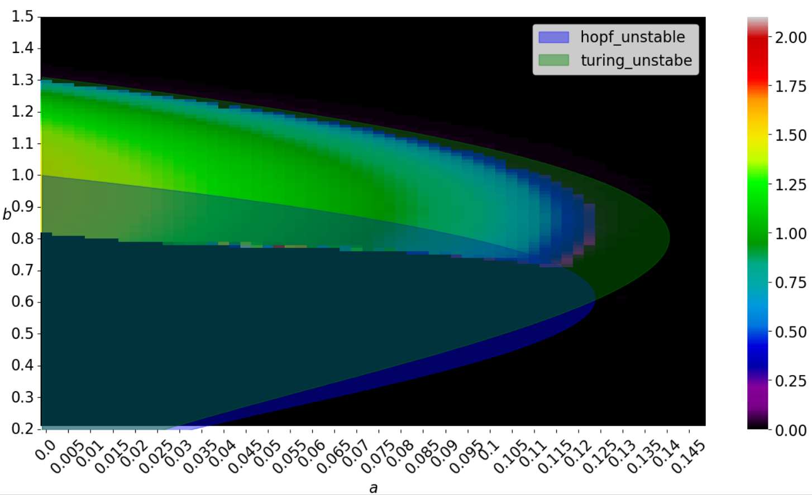

Примеры переходных процессов:

## Обычный

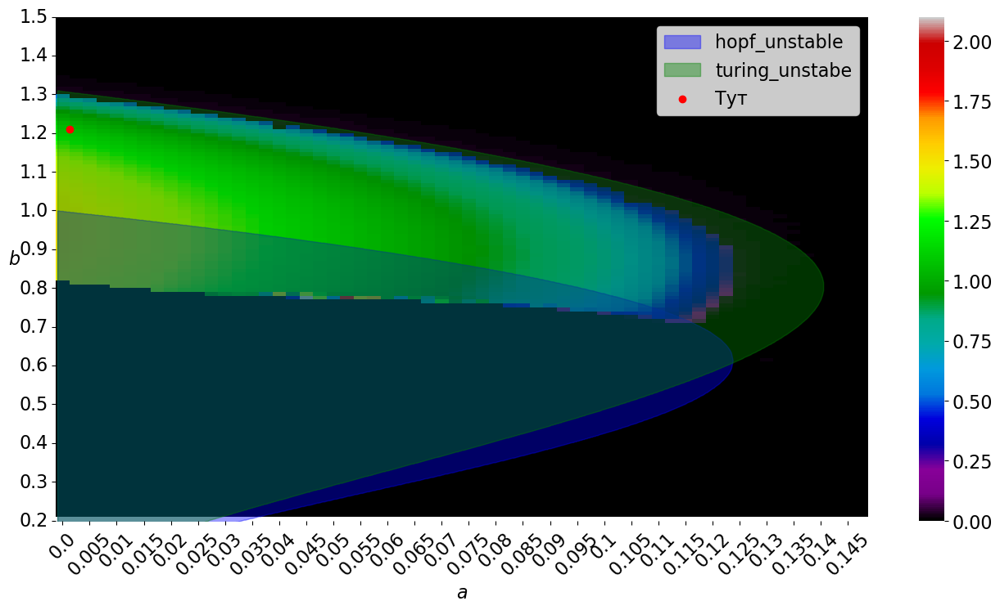

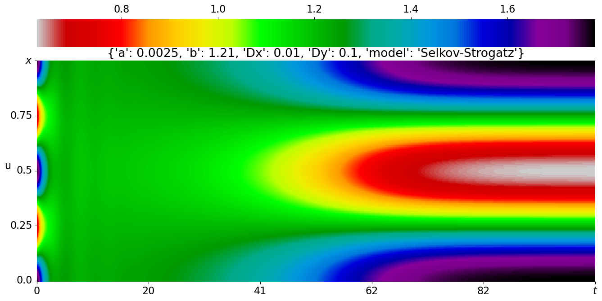

## Из зоны неустойчивости по Хопфу

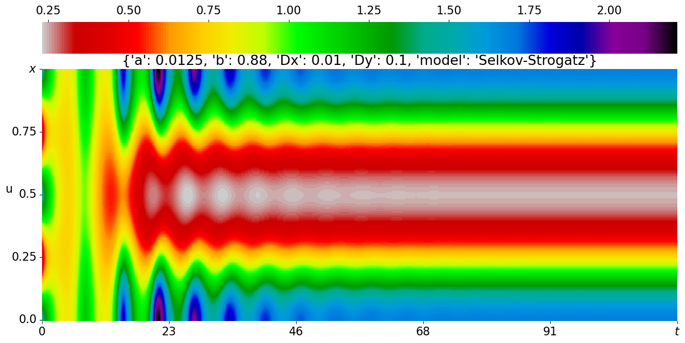

##  Затухающий

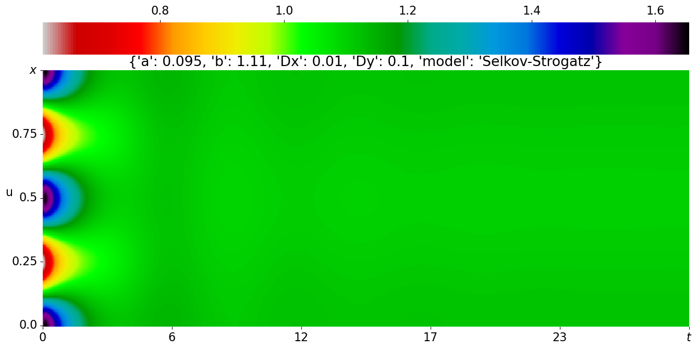