# Сельков-Строгац 2022.01.24

## Вспомним прошлое

В прошлом протоколе была такая картинка, где цвет - это амплитуда паттерна при данных a и b. В этой картинке одна точка - один эксперимент. Тут $x \in [0, 1]$.

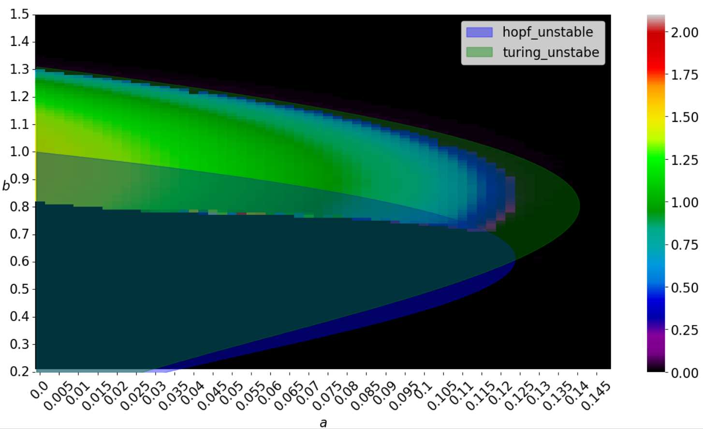

## Отличия
Пространственная координата $x \in [0, 5]$, чтобы паттерны были поразнообразнее. Плюс для каждой комбинации параметров (a, b) запускалось много экспериментов (500), чтобы на статистики поглядеть.

## Общий вид

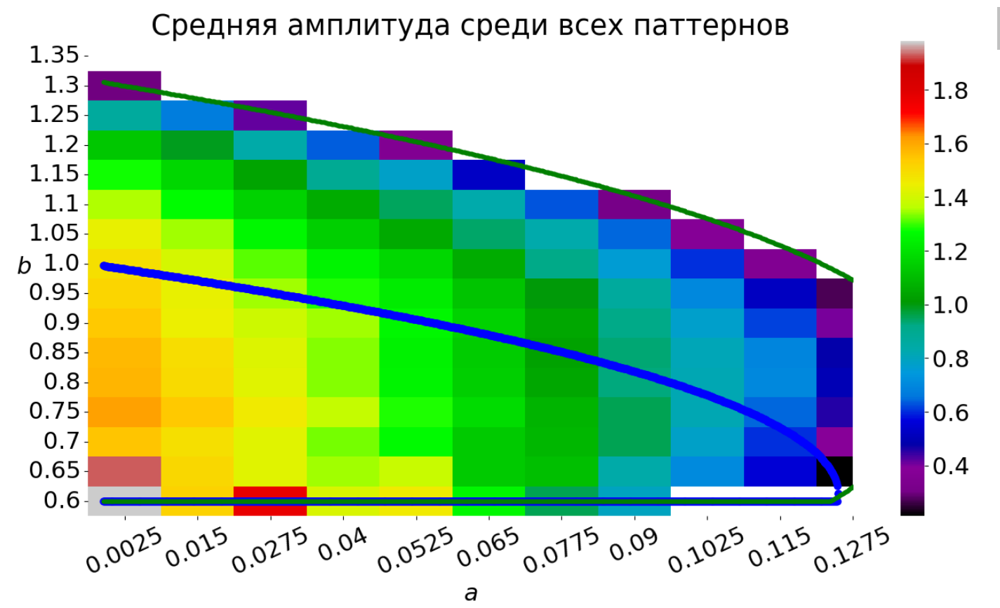

Почему-то при расширении пространства генерация уползла дальше в зону циклов.

Причём при углублении в зону циклов какие-то процессы приходят к гомогенному состоянию и осцилляциям. Вот доля процессов в каждой конфигурации, пришедших в паттерн:

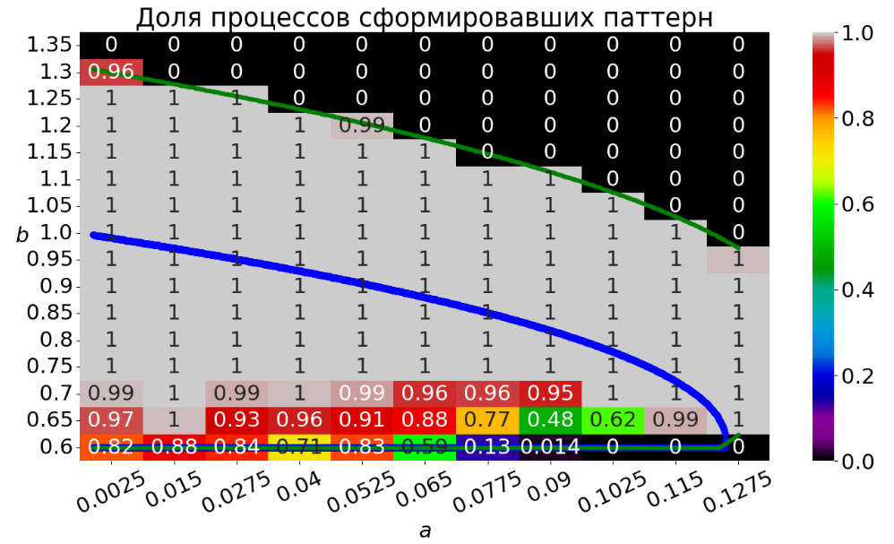

## Анализ амплитуд a=0.0025, b=0.6

Это всё крайне подозрительно. Рассмотрим эксперименты для a=0.0025, b=0.6. Их там 500, как и в любой другой ячейке. Построим амплитуды их итоговых состояний на графике, отсортировав их по возрастанию.

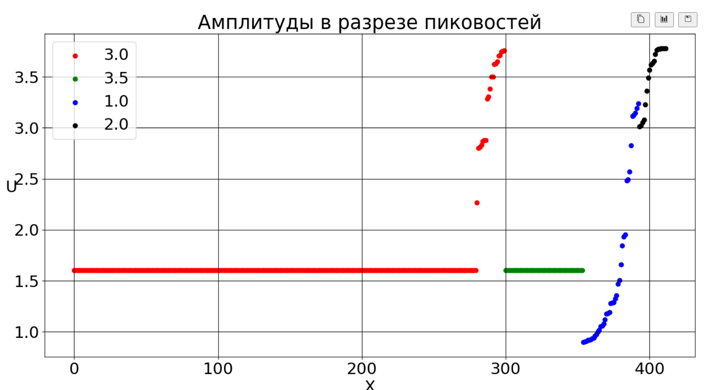

Видно четыре кластера.

Рассмотрим примеры:

* Красный кластер
  * "полоска"
    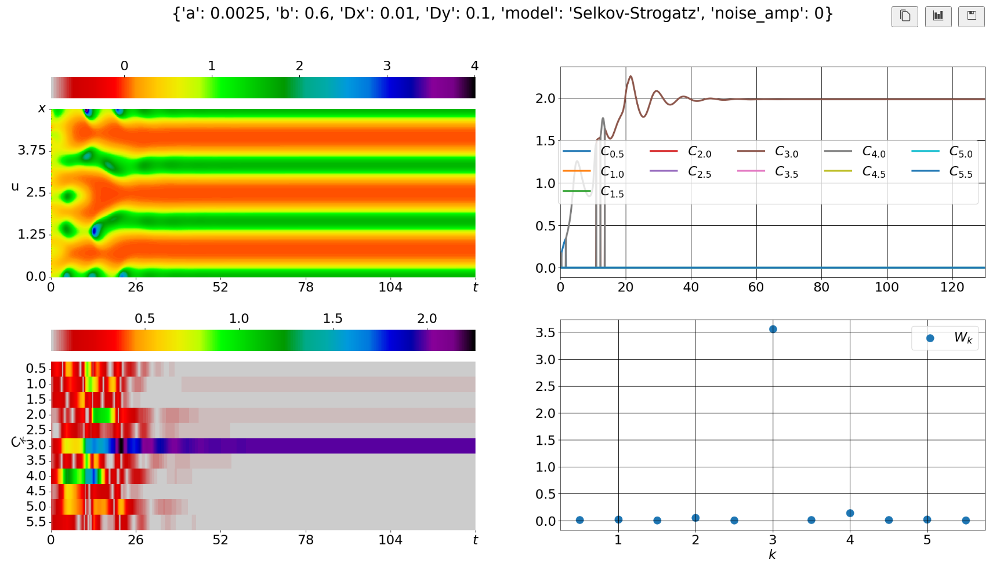
  * "россыпь"
    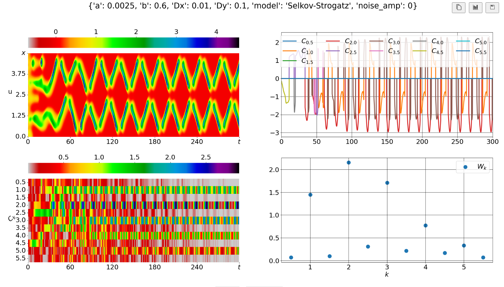
* Зелёный кластер
  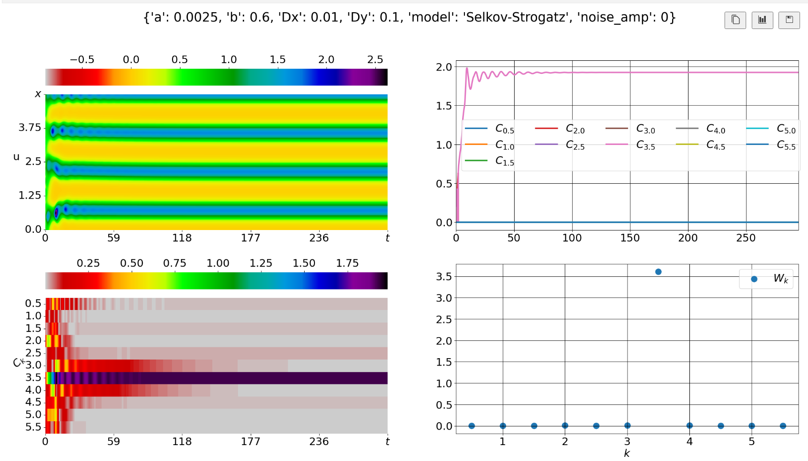
* Синий кластер
    * Полевее
        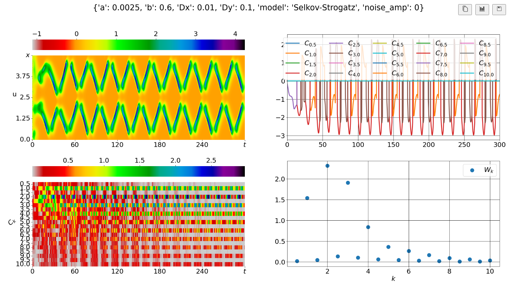
    * Поправее
        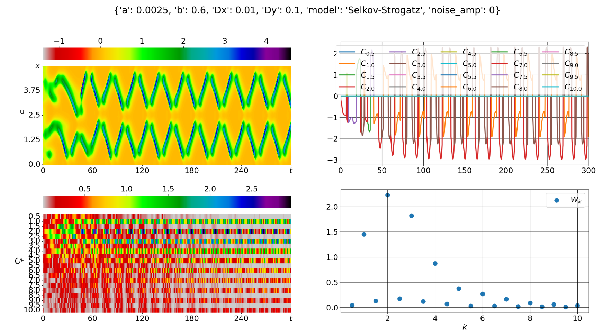
* Чёрный кластер
  * Полевее
        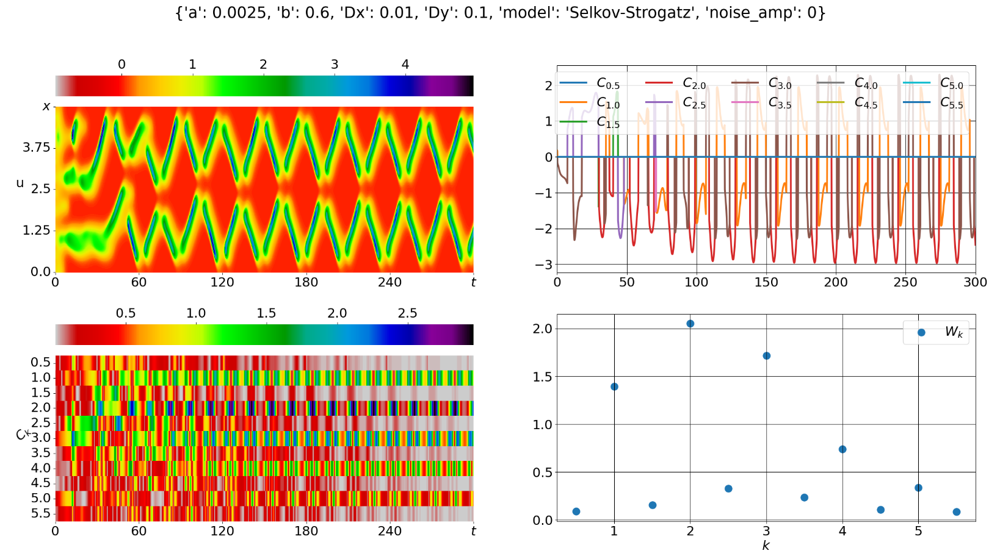
  * Поправее
        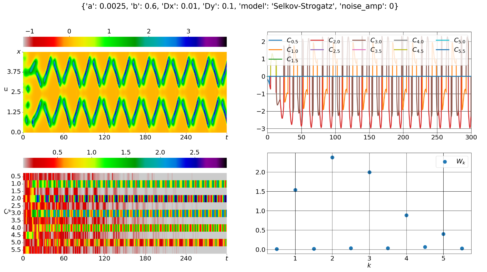

## Анализ амплитуд a=0.015, b=1.15
Это уже из честной теоретической зоны генерации.

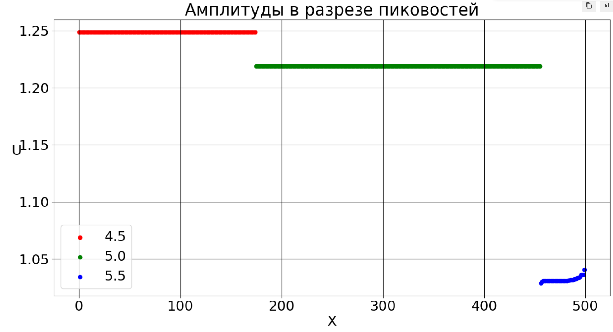

* Красный кластер
    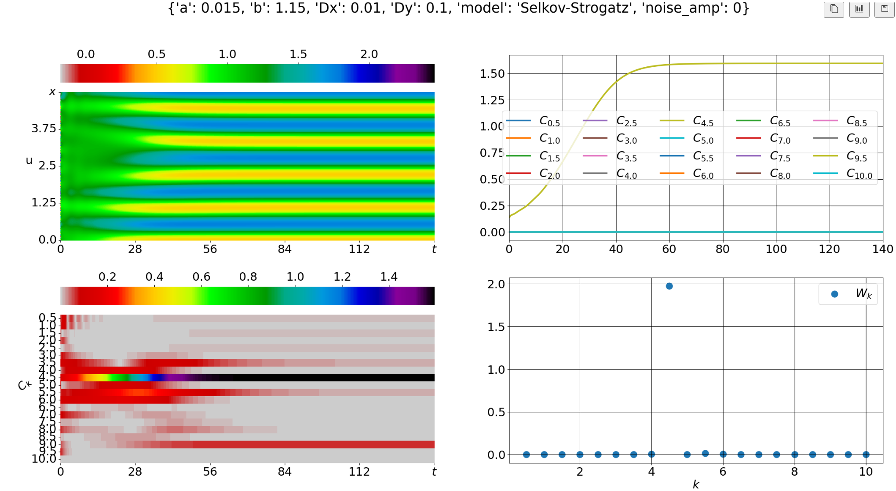
* Зелёный кластер
    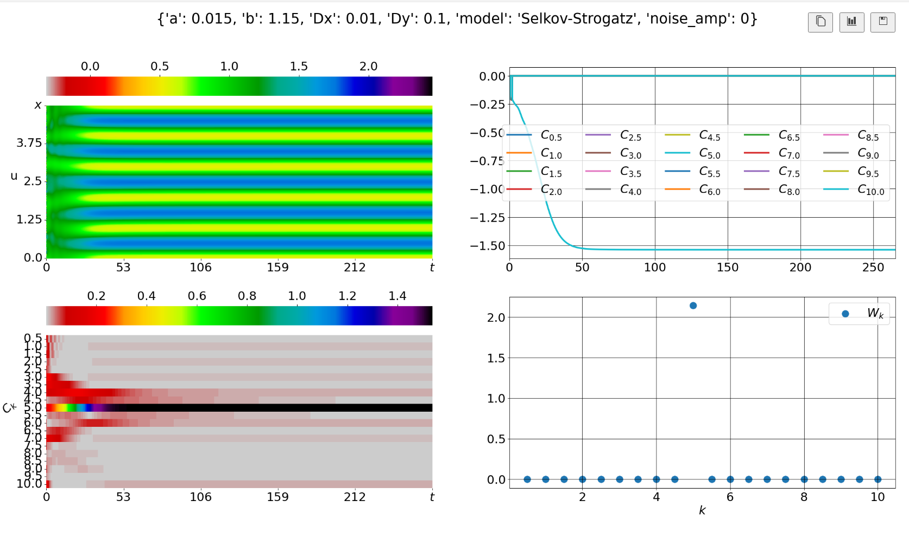
* Синий кластер
    * Полевее
        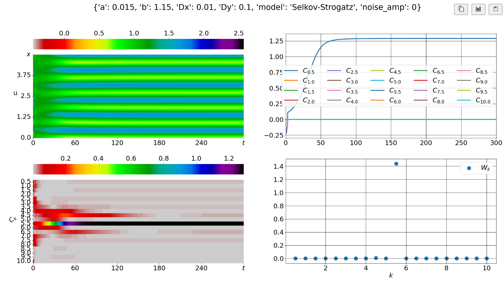
    * Поправее
        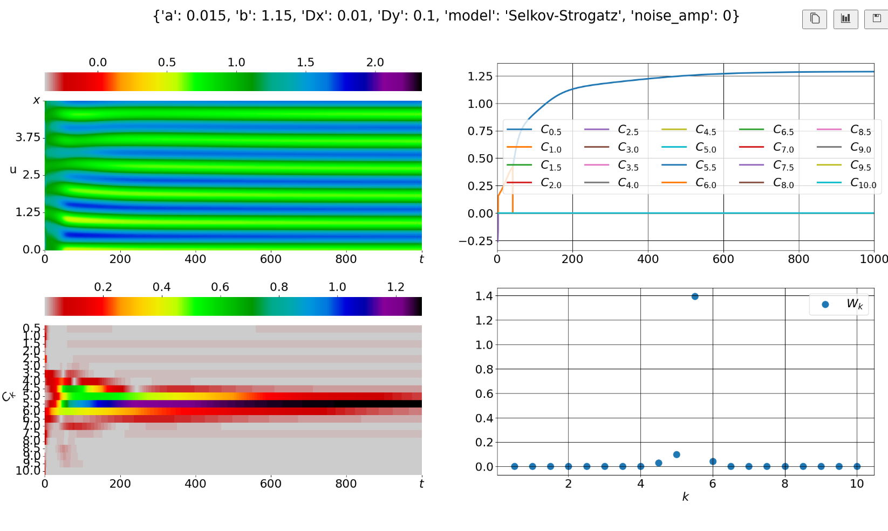