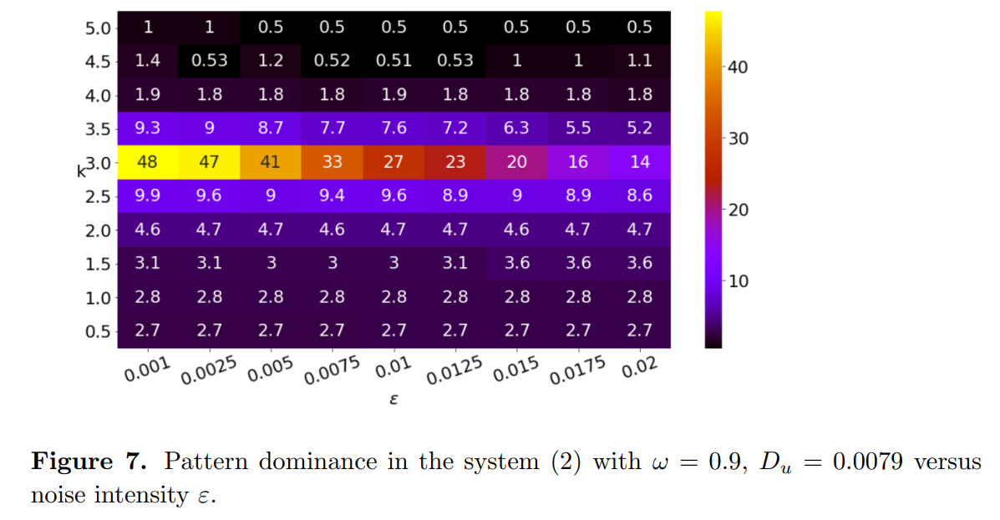
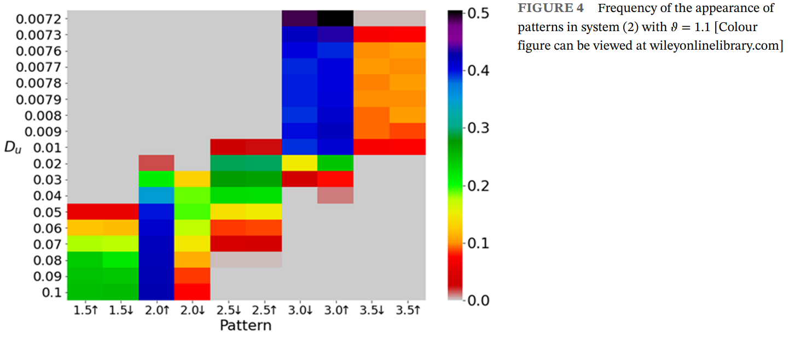
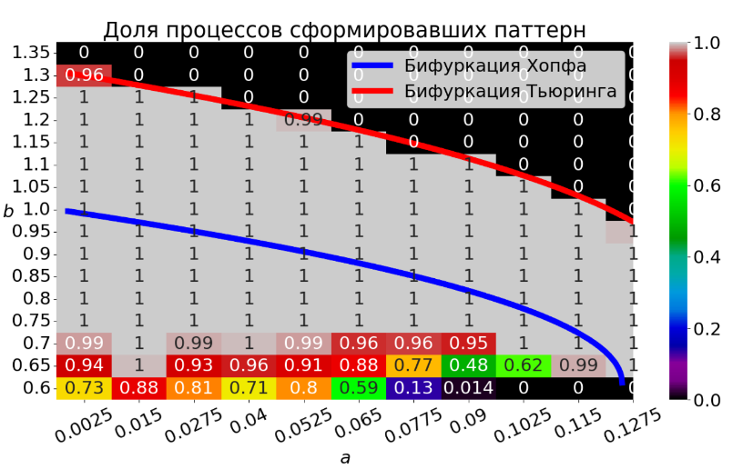
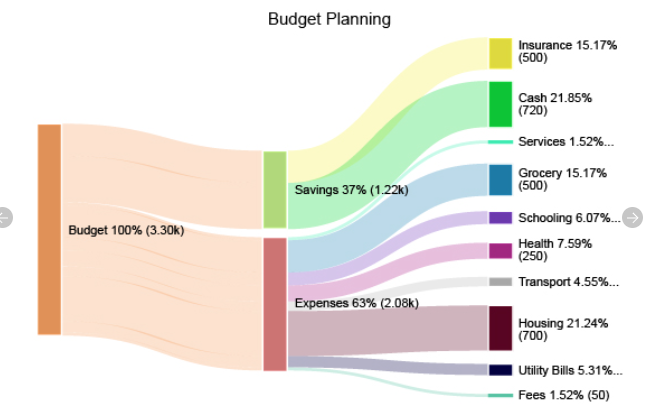
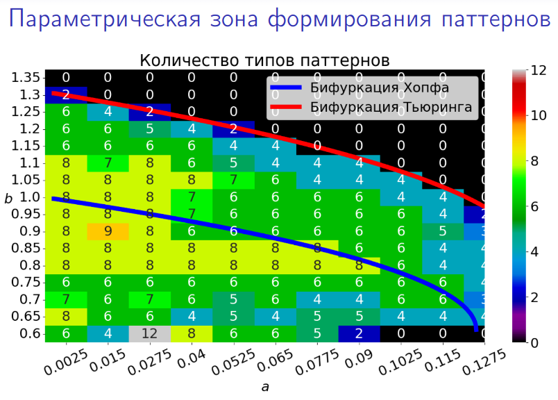

# Про темы спецвыпуска
Topics of interest include, but are not limited to, the following list. Я зачеркнул всё, что нам будто б точно не подходит.

* Sensitivity analysis, verification and validation, <s>and optimization under uncertainty</s>
* Machine learning approaches for UQ for dynamical systems
* <s>Reliability modeling and design optimization of dynamic networks</s>
* <s>Data assimilation</s>
* <s>Uncertainty of error modelling for dynamical systems</s>
* <s>Optimization and control under uncertainty</s>

Ну то есть говорить надо о чём-то, что описывает чувствительность системы или нашу уверенность в результатах наших численных экспериментов

# Что у нас есть по теме
📜 - публиковали в статьях

🆕 - не публиковали в статьях

## 📜 Автоматическая детекция одномерных паттернов с помощью гармонических коэффициентов

Ну тут всё понятно, считаем $C_k(t)=\int_0^L u(t, x) \cos (2 \pi x k / L) d x$, берём argmax по k

## 📜 Коэффициенты представленности и их вариации

$$W_K = \int_0^T C_k^2(t) dt$$

Для одномерного процесса с шумом, который скачет с паттерна на паттерн, помогают понять, какая пиковость доминирует.

В `Noise-induced formation of heterogeneous patterns in the Turing stability zones of diffusion systems` была ещё вот такая картинка c $W_k$ от параметра:

## 📜 Количественный анализ частоты появления паттернов

Публиковали в `Selkov glycolytic model with diffusion: Patterns, multistability, and stochastic transitions`

Было б очень интересно соотнести эти соотношения с графиком соотношением $W_k$ в процессе с шумом, мы не сделали этого почемут-то.

## 🆕 Снова количественный анализ частоты появления паттернов

На Сопромате в презентации была вот такая картинка, посвящённая зоне фактической генерации паттернов:

❗ В статьях мы такое не светили, но идейно это похоже на картинку из пункта выше: мы так же пересчитываем результаты генерации и смотрим чего вышло. 
По идее я тут могу сделать ещё совсем новую штуку. Идея такая:
1. Берём 1000 разных начальных условий. Выбираем один параметр системы для варьирования
2. Для, скажем, 10 значений параметра считаем детермнированные процессы, начиная с каждого из 1000 начальных условий.
3. Получаем что-то вроде: сперва всё сошлось к 2.5 или 3.5 пикам, а потом часть из того, что было 3.5 превратилась в 4, часть ещё во что-то. Т.е. масса экспериментов перетекает из одной пиковости в другую.
4. Визуализируем это примерно так:

## 🆕 Сводка по разнообразию паттернов как мера "неопределённости" системы

Как на картинке из презентации к сопромату

❗ Можно, опять же, расширить эту характеристику до некоторой совершенной новой, только что придумал, смотрите:

1. Запускаем 1000 детерминированных экспериментов со случайных начальных данных
2. Получаем, что N случаев сошлось к одному паттерну, M к другому и так далее
3. Интерпретируем это как дискретную случайную величину, которая принимает значение "исход с такой-то пиковостью" с вероятностью, которую мы частотно по данным найдём
4. Считаем энтропию этого счастья, получаем меру неопределённости состояния системы. Добавленная стоймость от введения энтропии такая: теперь ситуация вида "991 паттерн 3.5 и 9 разных" будет менее неопределённой, чем "по 100 паттернов каждого вида". Ну и это единственное число, рисовать можно, красиво.

# Отдельно про двумерный случай. 
Ничего из вышесказанного не применяется нормально к нему, т.к. всё полагается на статистики, т.е. автоматическую классификацию паттернов на типы. Следствие из этого: даже "узкая" постановка задачи машинного обучения имеет смысл: расширить эти статистики на конкретную двумерную систему. Так постановка даже почти не кажется высосанной из пальца.